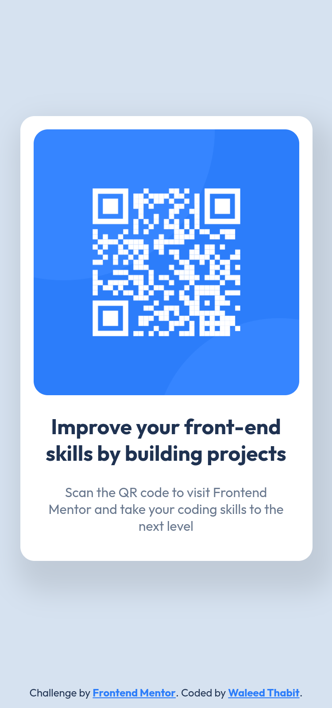
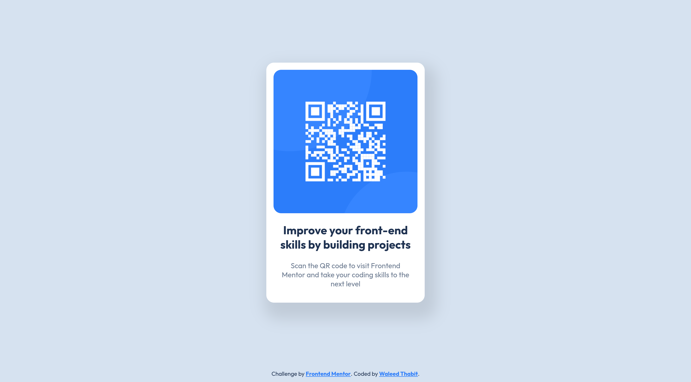

# Frontend Mentor - QR code component solution

This is a solution to the [QR code component challenge on Frontend Mentor](https://www.frontendmentor.io/challenges/qr-code-component-iux_sIO_H). Frontend Mentor challenges help you improve your coding skills by building realistic projects.

## Table of contents

- [Overview](#overview)
  - [Screenshot](#screenshot)
  - [Links](#links)
- [My process](#my-process)
  - [Built with](#built-with)
  - [What I learned](#what-i-learned)
  - [AI Collaboration](#ai-collaboration)
- [Author](#author)

## Overview

### Screenshot

Mobile:



Desktop:



### Links

- Solution URL: [https://github.com/waleed-thabit/qr-code-component](https://github.com/waleed-thabit/qr-code-component)

## My process

### Built with

- Semantic HTML5 markup
- CSS custom properties
- Flexbox
- CSS Grid
- Mobile-first workflow
- Vanilla HTML and CSS only, no frameworks

### What I learned

The main thing I learned is how to center an element on the page **without getting a scrollbar**.

My structure was a `main` container holding the card (an `article`), and a `footer` placed directly inside the `body`. At first I gave the `main` a `min-height: 100dvb`, but because the footer sat below it, the page became taller than the screen and a scroll appeared. I patched it with `min-height: 98dvb`, but that is just a hack that breaks on other screens.

The proper fix: make the `body` a flex column with the full screen height, and let the `main` take all the remaining space with `flex: 1`. Then I center the card inside it.

```css
body {
  display: flex;
  flex-direction: column;
  min-height: 100dvb;
}

main {
  display: grid;
  flex: 1;
  place-items: center;
}
```

This way the footer keeps its own space, the `main` fills the rest, and the card stays centered with no scroll.

### AI Collaboration

I did not use AI tools to build this project. I used **Claude** only to help me write this README.

## Author

- GitHub - [@waleed-thabit](https://github.com/waleed-thabit)
- Frontend Mentor - [@waleed-thabit](https://www.frontendmentor.io/profile/waleed-thabit)
